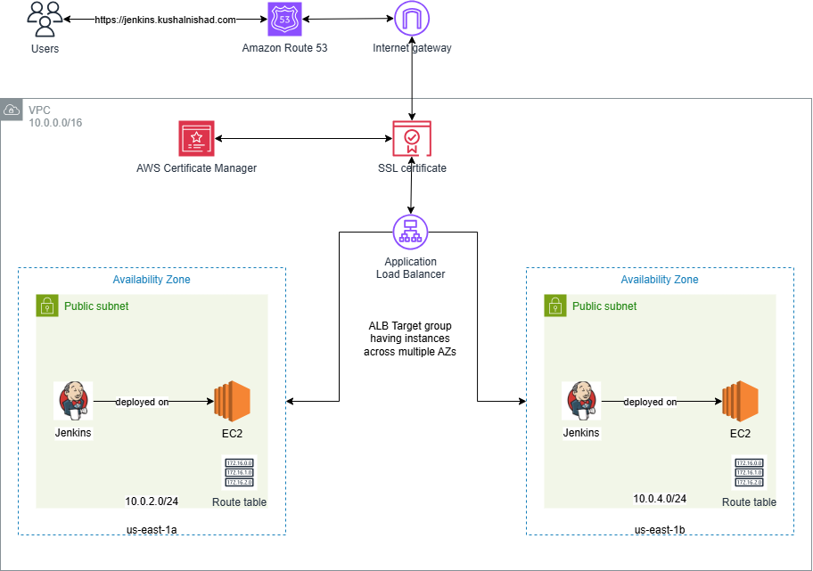

### AWS Jenkins Infra Setup
```markdown
This repository contains Terraform configurations to provision and manage AWS infrastructure for
deploying a Jenkins server on EC2 instance us-east-1. It supports both automated provisioning and deployment using Terraform.

🚀 Features

- 🏗️ Infrastructure-as-Code with Terraform
- ☁️ Deploys to AWS using EC2, VPC, Subnets, Security Groups, ALB, RDS, Route 53, and Certificate Manager
- 🛠️ Deploy Jenkins server on EC2 instance
- 📦 Modular and reusable Terraform code
```

### Architecture Diagram
📝 Note: The diagram below demonstrates a high availability setup by deploying EC2 instances across multiple subnets (e.g., us-east-1a and us-east-1b). However, for this project, the Terraform code provisions a single Jenkins instance in us-east-1a. The diagram is intended solely to help visualize the concept of high availability.


### Project Structure
```
├── terraform-infra-setup/
│   ├── modules/
│   │   ├── certificate-manager/           # ACM certificate provisioning
│   │   ├── hosted-zone/                   # Route 53 hosted zone setup
│   │   ├── jenkins/                       # EC2 instance setup for Jenkins
│   │   ├── jenkins-runner-script/         # Script to install Jenkins and its dependencies
│   │   ├── load-balancer/                 # Load Balancer
│   │   ├── load-balancer-target-group/    # Load Balancer Target Group
│   │   ├── networking/                    # VPC, subnets, route tables
│   │   ├── security-groups/               # Security group definitions
│   ├── main.tf                            # Root Terraform config
│   ├── outputs.tf                         # Output variables
│   ├── provider.tf                        # Provider configuration
│   ├── terraform.tfvars                   # Variable values
│   ├── variables.tf                       # Input variables
└── README.md                              # You're here!

```

### Setup Instructions

#### 1. Clone the Repository
```
bash
git clone https://github.com/KushalNishad/AWS-Jenkins-Infra-Setup.git
cd AWS-Flask-App-Infra-Setup
```

#### 2. Initialize Terraform
```bash
terraform init
```

#### 3. Plan and Apply Infrastructure
```bash
terraform plan
terraform apply
```

### 🧹 Tear Down

To destroy all resources:
```bash
terraform destroy
```
